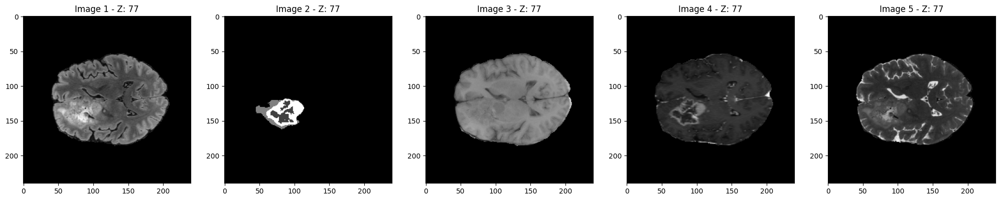
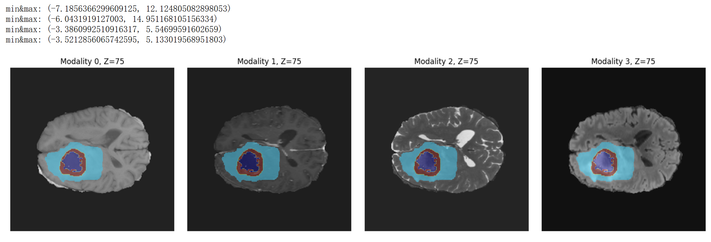

# PreProcPipe: Multimodal Medical Image Preprocessing Framework

An efficient framework for preprocessing CT/MRI and other multimodal medical images, supporting automated data preprocessing and metadata generation.




## Choose Language / 选择语言

- [English](readme_en.md)
- [简体中文](readme.md)

## Table of Contents

- [Main Features](#main-features)
- [Technical Architecture](#technical-architecture)
- [Code Implementation](#code-implementation)
- [User Guide](#user-guide)
- [Configuration & Extension](#configuration--extension)
- [Examples](#examples)

## Main Features

### 1. Preprocessing Pipeline (pipeline.py)
- Multimodal medical image data processing
- Intelligent Z-axis cropping
- Configurable data normalization
- Flexible image resampling
- Parallel processing support
- Automatic result saving

### 2. Metadata Auto-generation (LLM_metadata.py)
- Intelligent directory structure analysis
- LLM-driven metadata rule generation
- Automatic validation and error detection
- DeepSeek API integration

## Technical Architecture

### Preprocessing Pipeline Architecture

The preprocessing pipeline adopts a modular design, processing data in the following sequence:

1. **Data Input** → **SimplePreprocessor**
   - Receives multimodal medical image data
   - Supports .nii format files

2. **Data Loading**
   - Reads multimodal image data
   - Reads segmentation data (if available)

3. **Z-axis Cropping**
   - Intelligently identifies effective regions
   - Removes redundant blank areas

4. **Normalization**
   - Supports z-score standardization
   - Supports min-max normalization

5. **Resampling**
   - Adjusts voxel spacing
   - Maintains image quality

6. **Size Adjustment**
   - Unifies output dimensions
   - Optional size configuration

7. **Output Processed Data**
   - Saves in standard format
   - Generates processing metadata

### Metadata Generation System Architecture

The metadata generation system uses an LLM-driven intelligent analysis process:

1. **Dataset Root Directory** → **Directory Structure Analysis**
   - Scans file system
   - Identifies file organization patterns

2. **Random Sampling**
   - Selects representative samples
   - Analyzes file naming patterns

3. **DeepSeek API Call**
   - Sends structured requests
   - Receives AI analysis results

4. **Generate Processing Code**
   - Automatically generates Python scripts
   - Contains data processing logic

5. **Execution and Validation**
   - Runs generated code
   - Checks processing results

6. **Generate metadata.csv**
   - Records dataset information
   - Establishes index relationships

## Code Implementation

### Core Class: SimplePreprocessor

```python
class SimplePreprocessor:
    def __init__(self, target_spacing=[1.0, 1.0, 1.0], 
                 normalization_scheme="z-score", 
                 target_size=None):
        """
        Initialize preprocessor
        
        Parameters:
        - target_spacing: Target voxel size, default [1.0, 1.0, 1.0]
        - normalization_scheme: Normalization scheme ("z-score"/"min-max")
        - target_size: Target size, e.g., [256, 256]
        """
```

#### Main Methods:

1. **Data Loading**
```python
def read_images(self, image_paths):
    """Load multimodal image data"""

def read_seg(self, seg_path):
    """Load segmentation data"""
```

2. **Data Preprocessing**
```python
def crop(self, data_list, seg):
    """Z-axis intelligent cropping"""

def _normalize_single_modality(self, data):
    """Single modality data normalization"""

def compute_new_shape(self, old_shape, old_spacing, new_spacing):
    """Calculate resampling target shape"""

def resample_data(self, data, new_shape, order=3):
    """Data resampling"""

def resize_to_target_size(self, data, target_size, order=3):
    """Adjust data size"""
```

3. **Processing Flow**
```python
def run_case(self, image_paths, seg_path=None):
    """Execute complete preprocessing workflow"""
```

### Metadata Generation System

```python
def analyze_directory(root_directory, sample_folder_count=5, sample_file_count=10):
    """Analyze directory structure and sample"""

def generate_metadata(root_directory, your_api_key=None):
    """Use LLM to generate metadata processing code"""

def execute_metadata_script(root_directory):
    """Execute and validate metadata generation"""
```

## User Guide

### 1. Basic Preprocessing Flow

```python
from pipeline import SimplePreprocessor

# Initialize preprocessor
preprocessor = SimplePreprocessor(
    target_spacing=[1.0, 1.0, 1.0],
    normalization_scheme="z-score",
    target_size=[256, 256]
)

# Prepare data paths
image_paths = [
    "path/to/flair.nii",
    "path/to/t1.nii",
    "path/to/t1ce.nii",
    "path/to/t2.nii"
]
seg_path = "path/to/seg.nii"

# Execute preprocessing
data_list, seg, spacing, properties = preprocessor.run_case(image_paths, seg_path)
```

### 2. Batch Processing

```python
from pipeline import run_in_parallel

# Prepare multiple samples
cases = [
    {
        "sample_id": "case_001",
        "image_paths": ["path/to/case1/flair.nii", ...],
        "seg_path": "path/to/case1/seg.nii"
    },
    # More samples...
]

# Parallel processing
results = run_in_parallel(preprocessor, cases, "output_dir", num_workers=4)
```

### 3. Metadata Generation

```python
from LLM_metadata import analyze_directory, generate_metadata, execute_metadata_script

# Analyze directory structure
analyze_directory(root_directory="dataset_path", 
                 sample_folder_count=5, 
                 sample_file_count=10)

# Generate metadata code
generate_metadata(root_directory="dataset_path", 
                 your_api_key="your-deepseek-api-key")

# Execute generated code
execute_metadata_script(root_directory="dataset_path")
```

## Configuration & Extension

### 1. Preprocessing Configuration

Customize preprocessing behavior by modifying SimplePreprocessor initialization parameters:

- `target_spacing`: Adjust target voxel size
- `normalization_scheme`: Choose normalization scheme
- `target_size`: Set output dimensions

### 2. Extension Features

#### Add New Normalization Method:

```python
def _normalize_custom(self, data):
    """
    Custom normalization method
    """
    # Implement your normalization logic
    return normalized_data

# Add in SimplePreprocessor
if self.normalization_scheme == "custom":
    data = self._normalize_custom(data)
```

#### Add New Preprocessing Step:

```python
def new_preprocessing_step(self, data):
    """
    New preprocessing step
    """
    # Implement new preprocessing logic
    return processed_data

# Add in run_case method
data_list = [self.new_preprocessing_step(d) for d in data_list]
```

## Examples

### 1. Single Modality CT Image Preprocessing

```python
# Initialize preprocessor
preprocessor = SimplePreprocessor(
    target_spacing=[1.0, 1.0, 1.0],
    normalization_scheme="min-max"
)

# Process single CT image
image_paths = ["path/to/ct.nii"]
data_list, _, spacing, properties = preprocessor.run_case(image_paths)
```

### 2. Multimodal MRI Data Processing

```python
# Initialize preprocessor
preprocessor = SimplePreprocessor(
    target_spacing=[1.0, 1.0, 1.0],
    normalization_scheme="z-score",
    target_size=[256, 256]
)

# Process multimodal MRI data
image_paths = [
    "path/to/flair.nii",
    "path/to/t1.nii",
    "path/to/t1ce.nii",
    "path/to/t2.nii"
]
seg_path = "path/to/seg.nii"

# Execute preprocessing
data_list, seg, spacing, properties = preprocessor.run_case(image_paths, seg_path)
```

### 3. Auto-generate Dataset Metadata

```python
# Configure parameters
root_dir = "path/to/dataset"
api_key = "your-deepseek-api-key"

# Execute complete metadata generation workflow
analyze_directory(root_dir, sample_folder_count=5)
generate_metadata(root_dir, api_key)
execute_metadata_script(root_dir)
```

## Important Notes

1. Ensure correct input data format (supports .nii format)
2. Check sufficient disk space (processed data may be large)
3. Monitor memory usage (when processing large datasets)
4. Set appropriate parallel processing worker count
5. Backup original data
